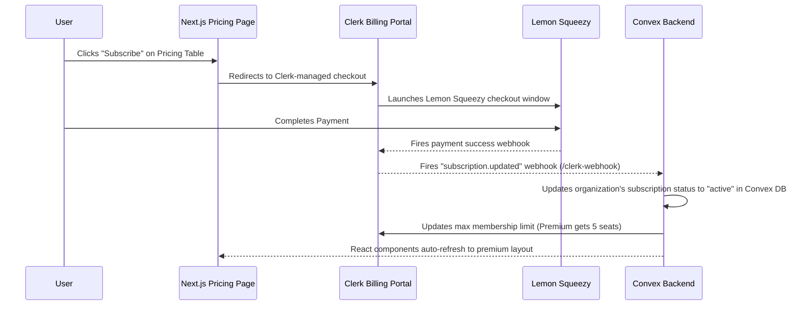

# Implementation Plan - Lemon Squeezy Payments via Clerk Billing

Your Zephyra repository is already 99% fully integrated with Clerk Billing, which natively connects with Lemon Squeezy. This plan outlines the exact configuration steps needed on your side (Clerk & Lemon Squeezy dashboards) and what we need to finalize the connection.

---

## Technical Overview

Clerk Billing acts as the middleman between your application and Lemon Squeezy. The data flow operates as follows:

---

## 🛠️ What You Need to Do (On Your Side)

### Step 1: Configure Lemon Squeezy
1. Go to your [Lemon Squeezy Dashboard](https://app.lemonsqueezy.com/).
2. Navigate to **Store Settings** -> **API keys** and create a new API key.
3. Set up your subscription products/plans in Lemon Squeezy (e.g., *Zephyra Pro Plan*).

### Step 2: Enable Clerk Billing
1. Open your [Clerk Dashboard](https://dashboard.clerk.com/) and select your Zephyra project.
2. Go to **Billing** in the sidebar.
3. Choose **Lemon Squeezy** as your billing provider.
4. Input your Lemon Squeezy API Key to link your store.
5. Under **Plans**, sync/import the plans you created in Lemon Squeezy, then configure the pricing table layout.

### Step 3: Setup Clerk Webhooks (Syncing Convex)
To let Convex know when a user pays, you need to tell Clerk to send webhooks to your Convex backend:
1. In your **Clerk Dashboard**, go to **Webhooks** -> **Add Endpoint**.
2. Set the **Endpoint URL** to your production Convex webhook URL:
   `https://wry-cod-309.convex.cloud/clerk-webhook`
3. Under **Message Filtering**, select only the **`subscription.updated`** event.
4. Click **Create**.
5. Copy the **Signing Secret** (it will look like `whsec_...`).

---

## 🔑 What I Need From You

To finalize the integration and make sure the backend verified webhooks securely, please provide or configure:
1. **Clerk Webhook Secret**: The `whsec_...` signing secret from the webhook you created in Step 3.
2. **Setup in Convex Environment Variables**:
   - In your **Convex Dashboard** (for your `wry-cod-309` deployment), please go to **Settings** -> **Environment Variables** and add:
     - **Key:** `CLERK_WEBHOOK_SECRET`
     - **Value:** `YOUR_CLERK_SIGNING_SECRET` (the `whsec_...` key)
     - **Key:** `CLERK_SECRET_KEY`
     - **Value:** `YOUR_CLERK_SECRET_KEY` (so Convex can call Clerk's update membership API)

---

## Verification Plan

Once you set up the environment variables, we will verify the flow using these checks:
1. **Mock Checkout**: We can put Clerk Billing in test mode to run a simulated transaction.
2. **Webhook Reception Log**: We will check the Convex function logs for successful `/clerk-webhook` execution upon receiving the `subscription.updated` payload.
3. **Database Assertion**: We will confirm a subscription record is successfully upserted in the Convex `subscriptions` table.
